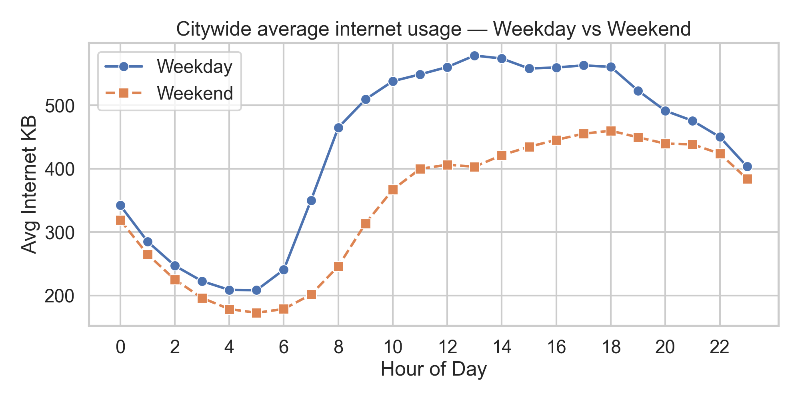
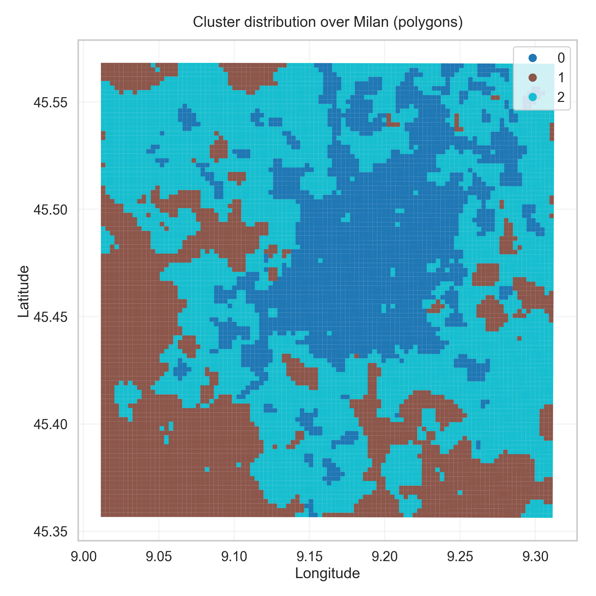
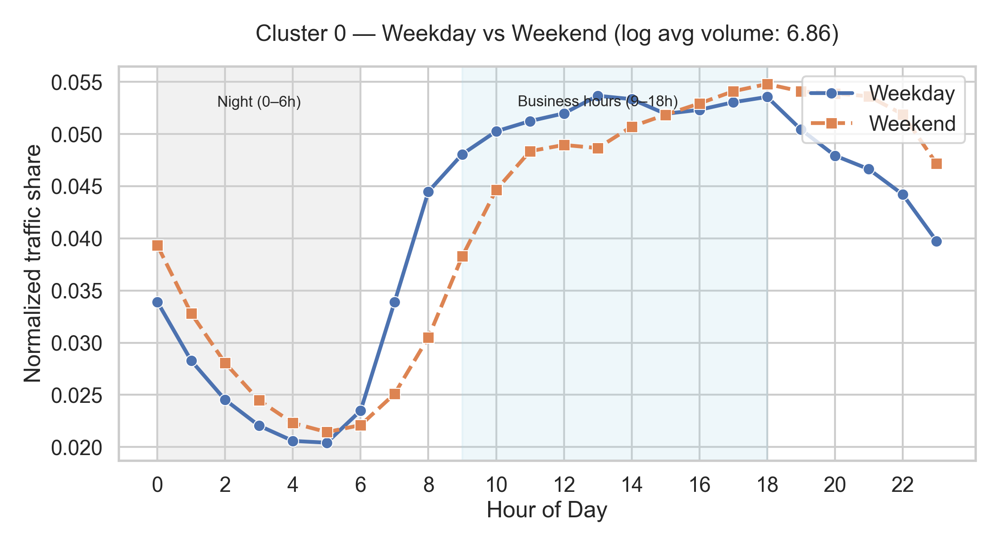

# 📊 CDR Mobility & Traffic Analytics — Milan

  
*Clustering Milan’s digital heartbeat from mobile phone activity.*

---

## 📌 Project Overview
This project analyzes **mobile phone activity in Milan** using the [Kaggle CDR dataset](https://www.kaggle.com/datasets/marcodena/mobile-phone-activity).  
We process Call Detail Records (CDR) to extract **spatial–temporal usage patterns**, cluster them with KMeans, and visualize insights in Python (and optionally Power BI).

**Goals:**
- Understand Milan’s **daily & weekly internet usage rhythms**.  
- Identify distinct **urban activity clusters** (business, residential, mixed-use).  
- Quantify each cluster’s **size, spatial footprint, and traffic contribution**.  
- Provide insights for **telecom planning** and **urban mobility studies**.  

---

## 🗂️ Repository Structure
```
project-root/
│
├── data/                        # Raw Kaggle CSVs + milano-grid.geojson
├── artifacts/                   # Saved outputs (CSVs + figures)
│   ├── figures/                 # Plots for reports & README
│   ├── clusters_by_cell.csv     # Cell → cluster mapping
│   ├── hourly_by_cell_with_cluster.csv
│   ├── hourly_city_totals.csv
│   ├── cluster_centers_long.csv
│   ├── cluster_scales.csv
│   └── k_evaluation.csv
│
├── notebooks/
│   ├── 01_load_prepare.ipynb    # Load raw data + build parquet + centroids
│   ├── 02_eda_features.ipynb    # EDA + feature engineering + clustering + export
│   ├── 03_analysis.ipynb        # Cluster analysis (plots + insights)
│   └── 04_report.ipynb          # Storytelling notebook (presentation-ready)
│
├── cdrlib/                      # Reusable pipeline functions
│   └── pipeline.py
│
└── README.md
```

---

## 📒 Notebooks Summary

### 1️⃣ Notebook 1 — Load & Prepare
- Loads all daily CSVs (`sms-call-internet-mi-*.csv`).  
- Builds master parquet (`milan_cdr_master.parquet`).  
- Extracts **cell centroids** from `milano-grid.geojson`.

---

### 2️⃣ Notebook 2 — EDA & Feature Engineering
- **Citywide EDA plots**:  
  - Daily curve (weekday vs weekend).  
  - Day/hour heatmap.  
  - Histogram of avg traffic per cell.  
- Builds **49-dim feature vectors** per cell (weekday shape, weekend shape, log volume).  
- Runs **KMeans clustering** for k=3..8 → chooses **k=3**.  
- Exports cluster labels + artifacts (CSV + plots).

---

### 3️⃣ Notebook 3 — Cluster Analysis
- Loads artifacts from Notebook 2.  
- **Plots & insights**:  
  - Model selection curve.  
  - Temporal cluster profiles.  
  - Spatial distribution map.  
  - Cluster sizes & traffic contributions.  
  - Hourly contribution curves.  
- Names clusters:  
  - **🏢 Business Hubs**  
  - **🏠 Residential Areas**  
  - **🛍️ Mixed-use Districts**

---

### 4️⃣ Notebook 4 — Report
- Polished, **presentation-ready storytelling notebook**.  
- Reuses saved plots with concise Markdown narratives.  
- Ends with **executive conclusions** for stakeholders.  

---

## 📊 Key Figures

| Citywide Patterns | Cluster Map | Cluster Profiles |
|-------------------|-------------|------------------|
|  |  |  |

---

## 📌 Conclusions
- Milan’s digital activity is best described by **3 urban clusters**:
  - **🏢 Business hubs** → downtown, daytime dominant, ~70% of traffic.  
  - **🏠 Residential areas** → suburbs, evening/weekend activity, lowest traffic.  
  - **🛍️ Mixed-use districts** → semi-central corridors, balanced usage.  
- A **small fraction of cells** (business core) dominate traffic, while suburbs and leisure zones provide complementary rhythms.  
- These insights support **telecom capacity planning** and **urban mobility strategies**.

---

## ⚙️ Tech Stack
- **Python**: Pandas, GeoPandas, Seaborn, Scikit-learn  
- **Jupyter Notebooks**: Analysis + Reporting  
- **Power BI (optional)**: Interactive dashboards from exported CSVs  

---

## 📥 Data Access
- Dataset: [Mobile Phone Activity (Milan CDR)](https://www.kaggle.com/datasets/marcodena/mobile-phone-activity)  

